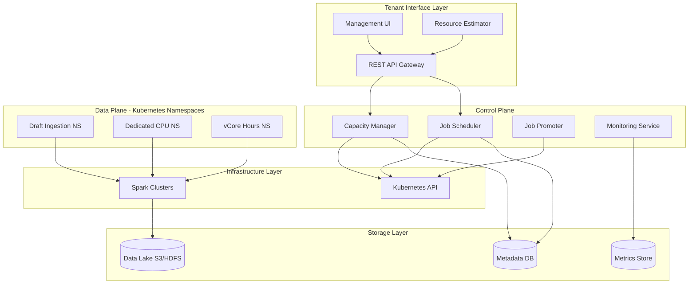
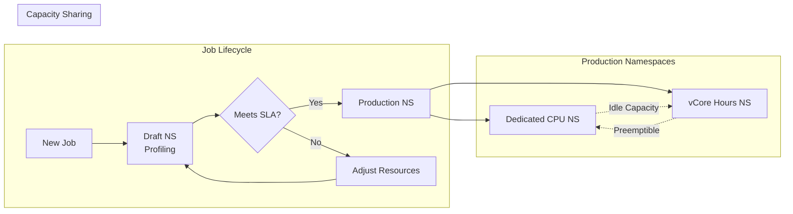
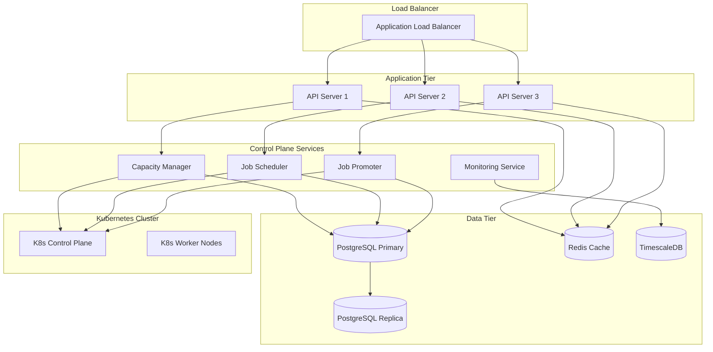

# Design Document: Spark Ingestion Resource Management System

## Overview

This document provides the architectural design for a managed Spark-based ingestion service that enables multi-tenant ETL workloads with flexible capacity models. The system supports both dedicated resource allocation and time-based consumption models, ensuring efficient utilization of underlying Spark infrastructure while providing predictable performance and cost management for tenants.

### Design Goals

1. **Flexible Capacity Models**: Support both dedicated units (reserved capacity) and vCPU hours (consumption-based)
2. **Efficient Resource Utilization**: Maximize usage of purchased Spark Units through intelligent scheduling and opportunistic capacity sharing
3. **Multi-Tenant Isolation**: Ensure fair resource allocation and prevent noisy neighbor problems
4. **Predictable Performance**: Validate job resource requirements through draft namespace profiling
5. **Scalability**: Support 100+ tenants with 500+ concurrent ingestion jobs
6. **Cost Transparency**: Provide accurate resource estimation and consumption tracking

## Architecture

### High-Level System Architecture



### Component Responsibilities

#### Capacity Manager
- Tracks Spark Unit allocations across namespaces
- Manages tenant capacity purchases (Dedicated Units and vCPU Hours)
- Calculates available capacity per namespace and time slice
- Enforces resource quotas and limits
- Handles opportunistic capacity sharing across namespaces

#### Job Scheduler
- Accepts ingestion job configurations and schedules
- Validates capacity availability for requested time slices
- Places jobs in appropriate namespaces based on capacity type
- Manages job lifecycle (create, update, delete, execute)
- Implements fair queuing for shared vCPU Hours namespace

#### Job Promoter
- Monitors jobs in Draft Ingestion Namespace
- Collects performance metrics and validates SLA compliance
- Promotes validated jobs to production namespaces
- Provides feedback to tenants on resource adjustments

#### Resource Estimator
- Analyzes historical job performance data
- Provides capacity recommendations based on data characteristics
- Compares cost implications of Dedicated vs vCPU Hours models
- Updates estimates based on actual execution metrics

#### Monitoring Service
- Collects real-time metrics from all running jobs
- Tracks vCPU hour consumption
- Generates alerts for SLA violations and capacity exhaustion
- Provides dashboards and reporting APIs

## Capacity Model Analysis

### Option 1: Dedicated Ingestion Units

**Description**: 1:1 mapping to Spark Units with reserved capacity

**Pros**:
- Predictable performance with guaranteed resources
- No competition with other tenants
- Simple billing model
- Ideal for large teams with consistent workloads
- No risk of capacity exhaustion during peak times

**Cons**:
- Higher cost due to reserved capacity
- Potential for underutilization during idle periods
- Less flexibility for variable workloads
- Requires accurate capacity planning upfront

**Best For**: Enterprise teams with steady-state ingestion requirements, strict SLA commitments, and predictable data volumes

### Option 2: vCPU Hours (Consumption-Based)

**Description**: Time-based units consumed as jobs execute

#### Time Period Options Analysis

##### Daily vCPU Hours
**Pros**:
- Maximum flexibility for variable daily workloads
- Lower commitment for testing and development
- Easy to adjust based on daily patterns

**Cons**:
- Requires frequent capacity monitoring
- Risk of exhaustion mid-day
- Higher administrative overhead
- Less predictable monthly costs

**Use Case**: Development/testing environments, ad-hoc analytics, highly variable workloads

##### Monthly vCPU Hours
**Pros**:
- Balanced flexibility and predictability
- Aligns with standard billing cycles
- Sufficient buffer for weekly variations
- Easier capacity planning than daily

**Cons**:
- Risk of month-end exhaustion
- May require mid-month top-ups
- Less granular than daily for cost allocation

**Use Case**: Production workloads with moderate variability, most common enterprise use case

##### Yearly vCPU Hours
**Pros**:
- Lowest per-unit cost (volume discount)
- Maximum predictability for budgeting
- Minimal administrative overhead
- Best for stable, long-term workloads

**Cons**:
- Highest upfront commitment
- Risk of over-purchasing for changing needs
- Difficult to adjust for business changes
- Unused capacity at year-end is wasted

**Use Case**: Mature, stable ingestion pipelines with well-understood capacity needs

#### Recommended Approach: Tiered Time Periods

Offer all three options with pricing incentives:
- **Daily**: $X per vCPU hour (highest rate, maximum flexibility)
- **Monthly**: $0.85X per vCPU hour (15% discount, recommended default)
- **Yearly**: $0.70X per vCPU hour (30% discount, best value)

Allow tenants to mix models (e.g., yearly base + monthly burst capacity)

### Hybrid Model Recommendation

**Optimal Strategy**: Allow tenants to combine both models
- **Base Capacity**: Dedicated Units for predictable baseline workload
- **Burst Capacity**: vCPU Hours for variable/seasonal spikes

**Benefits**:
- Cost optimization (pay for guaranteed capacity + variable usage)
- Performance guarantees for critical jobs
- Flexibility for growth and experimentation
- Better overall resource utilization

## Multi-Namespace Strategy

### Namespace Architecture



### Draft Ingestion Namespace

**Purpose**: Validate resource requirements before production deployment

**Configuration**:
- Shared pool with moderate resource limits
- Runs each new job N times (default: 3)
- Collects detailed metrics: CPU, memory, I/O, duration
- Lower priority than production namespaces

**Promotion Criteria**:
1. Job completes successfully for N consecutive runs
2. Actual execution time ≤ SLA + 10% tolerance
3. Resource utilization within expected bounds (60-90% of allocated)
4. No critical errors or failures

**Feedback Loop**:
- If job exceeds SLA: Recommend increased resources or relaxed SLA
- If job underutilizes: Recommend reduced resource allocation
- Provide cost impact analysis for recommendations

### Dedicated CPU Namespace

**Purpose**: Isolated environment for tenants with Dedicated Ingestion Units

**Configuration**:
- Kubernetes ResourceQuota set to tenant's purchased capacity
- LimitRange to prevent individual job over-allocation
- High priority scheduling class
- Network policies for tenant isolation

**Resource Allocation**:
```yaml
apiVersion: v1
kind: ResourceQuota
metadata:
  name: tenant-{tenant-id}-quota
  namespace: dedicated-cpu-ns
spec:
  hard:
    requests.cpu: "{dedicated_units * X}cores"
    requests.memory: "{dedicated_units * Y}Gi"
    limits.cpu: "{dedicated_units * X}cores"
    limits.memory: "{dedicated_units * Y}Gi"
```

### vCore Hours Namespace

**Purpose**: Shared environment for consumption-based tenants

**Configuration**:
- Dynamic resource quotas based on time-slice allocations
- Fair queuing to prevent tenant monopolization
- Medium priority scheduling class
- Opportunistic use of idle dedicated capacity

**Fair Scheduling Algorithm**:
1. Calculate each tenant's "fair share" based on purchased vCPU hours
2. Track actual consumption vs fair share over rolling window
3. Prioritize tenants with lowest consumption ratio
4. Implement weighted fair queuing for job admission

## Time-Slice Based Scheduling

### Time Slice Design

**Granularity**: 15-minute slices (96 slices per day)

**Rationale**:
- Fine enough for accurate capacity planning
- Coarse enough to minimize scheduling overhead
- Aligns with typical ingestion job durations (30min - 4hrs)

### Capacity Calculation Algorithm

```python
def calculate_time_slice_capacity(job, schedule):
    """
    Calculate required capacity for each time slice
    """
    job_duration_minutes = estimate_job_duration(job)
    job_cpu_cores = job.resource_request.cpu
    
    # Determine which time slices the job will occupy
    start_slice = get_time_slice(schedule.start_time)
    num_slices = ceil(job_duration_minutes / 15)
    
    capacity_requirements = []
    for i in range(num_slices):
        slice_id = start_slice + i
        # Calculate partial slice usage for first and last slices
        if i == 0:
            usage_fraction = calculate_first_slice_fraction(schedule.start_time)
        elif i == num_slices - 1:
            usage_fraction = calculate_last_slice_fraction(job_duration_minutes)
        else:
            usage_fraction = 1.0
        
        capacity_requirements.append({
            'slice_id': slice_id,
            'cpu_cores': job_cpu_cores * usage_fraction,
            'memory_gb': job.resource_request.memory * usage_fraction
        })
    
    return capacity_requirements
```

### Scheduling Validation

**Process**:
1. Tenant submits job with schedule (cron or interval)
2. Scheduler expands schedule to next 30 days of executions
3. For each execution, calculate time slice requirements
4. Check available capacity in target namespace for all slices
5. If insufficient capacity, return alternative time windows
6. If capacity available, reserve and confirm schedule

**Conflict Resolution**:
- Dedicated namespace: Reject if capacity unavailable (guaranteed resources)
- vCPU Hours namespace: Queue job and execute when capacity available
- Provide "next available slot" recommendations

## Cross-Namespace Capacity Sharing

### Opportunistic Scheduling

**Idle Capacity Detection**:
```python
def detect_idle_capacity(namespace, threshold=0.20, duration_minutes=5):
    """
    Identify idle capacity available for opportunistic use
    """
    current_utilization = get_namespace_utilization(namespace)
    idle_percentage = 1.0 - current_utilization
    
    if idle_percentage >= threshold:
        # Check if idle for minimum duration
        if is_idle_for_duration(namespace, duration_minutes):
            idle_cpu = namespace.total_cpu * idle_percentage
            idle_memory = namespace.total_memory * idle_percentage
            
            return {
                'available': True,
                'cpu_cores': idle_cpu,
                'memory_gb': idle_memory,
                'expires_at': now() + timedelta(minutes=5)
            }
    
    return {'available': False}
```

**Opportunistic Job Placement**:
- vCPU Hours jobs can use idle Dedicated namespace capacity
- Jobs marked as "preemptible" with 30-second grace period
- No vCPU hour charges for opportunistic execution
- Automatic migration back to vCPU Hours namespace on preemption

**Preemption Handling**:
1. Dedicated job requires resources
2. Identify preemptible jobs in Dedicated namespace
3. Send SIGTERM to preemptible jobs (30s grace period)
4. Checkpoint job state if supported
5. Requeue jobs in vCPU Hours namespace
6. Resume from checkpoint or restart

### Benefits and Trade-offs

**Benefits**:
- Improved overall resource utilization (target: 85%+ vs 60-70% without sharing)
- Lower costs for vCPU Hours tenants (free opportunistic cycles)
- Better ROI on Dedicated Unit purchases

**Trade-offs**:
- Added complexity in scheduling logic
- Potential job interruptions (mitigated by checkpointing)
- Need for robust state management

## Resource Estimation Tool

### Estimation Algorithm

**Input Parameters**:
- Source type (PostgreSQL, MySQL, S3)
- Estimated data volume (GB)
- Source characteristics (table count, row count, schema complexity)
- Target SLA (completion time)
- Ingestion frequency (hourly, daily, weekly)

**Estimation Logic**:
```python
def estimate_required_capacity(params):
    """
    Estimate required ingestion units based on workload characteristics
    """
    # Base throughput rates from historical data
    throughput_rates = {
        'postgresql': 500,  # MB/s per core
        'mysql': 450,
        's3': 800
    }
    
    base_throughput = throughput_rates[params.source_type]
    data_volume_mb = params.data_volume_gb * 1024
    
    # Calculate required processing time
    required_time_seconds = data_volume_mb / base_throughput
    
    # Apply complexity factors
    complexity_factor = calculate_complexity_factor(params)
    adjusted_time = required_time_seconds * complexity_factor
    
    # Calculate required cores to meet SLA
    sla_seconds = params.sla_minutes * 60
    required_cores = ceil(adjusted_time / sla_seconds)
    
    # Calculate memory requirements (rule of thumb: 2GB per core + data buffer)
    required_memory_gb = (required_cores * 2) + (params.data_volume_gb * 0.1)
    
    # Map to ingestion units
    cores_per_unit = SPARK_UNIT_CPU
    memory_per_unit = SPARK_UNIT_MEMORY
    
    units_for_cpu = ceil(required_cores / cores_per_unit)
    units_for_memory = ceil(required_memory_gb / memory_per_unit)
    
    recommended_units = max(units_for_cpu, units_for_memory)
    
    # Calculate costs for both models
    dedicated_cost = recommended_units * DEDICATED_UNIT_PRICE
    
    # vCPU hours calculation
    executions_per_month = calculate_monthly_executions(params.frequency)
    vcpu_hours_per_execution = (adjusted_time / 3600) * required_cores
    total_vcpu_hours = vcpu_hours_per_execution * executions_per_month
    vcpu_cost = total_vcpu_hours * VCPU_HOUR_PRICE
    
    return {
        'recommended_units': recommended_units,
        'required_cores': required_cores,
        'required_memory_gb': required_memory_gb,
        'estimated_duration_minutes': adjusted_time / 60,
        'dedicated_model': {
            'units': recommended_units,
            'monthly_cost': dedicated_cost
        },
        'vcpu_hours_model': {
            'hours_per_execution': vcpu_hours_per_execution,
            'monthly_hours': total_vcpu_hours,
            'monthly_cost': vcpu_cost
        },
        'recommendation': 'dedicated' if dedicated_cost < vcpu_cost else 'vcpu_hours',
        'confidence': calculate_confidence_score(params)
    }
```

### Continuous Learning

**Feedback Loop**:
1. Initial estimate provided to tenant
2. Job runs in Draft namespace with actual metrics collected
3. Compare estimated vs actual resource usage
4. Update estimation model with new data point
5. Refine estimates for similar job profiles

**Model Improvement**:
- Maintain separate models per source type
- Cluster jobs by characteristics (data volume, schema complexity)
- Use regression analysis to improve throughput predictions
- Track estimation accuracy and display confidence scores


## Data Models

### Core Entities

#### Tenant
```json
{
  "tenant_id": "uuid",
  "name": "string",
  "created_at": "timestamp",
  "status": "active|suspended|deleted",
  "contact_email": "string",
  "billing_account_id": "string"
}
```

#### Capacity Purchase
```json
{
  "purchase_id": "uuid",
  "tenant_id": "uuid",
  "capacity_type": "dedicated|vcpu_hours",
  "quantity": "number",
  "unit_type": "ingestion_units|vcpu_hours",
  "time_period": "daily|monthly|yearly",
  "purchase_date": "timestamp",
  "valid_from": "timestamp",
  "valid_until": "timestamp",
  "status": "active|expired|cancelled",
  "cost": "decimal",
  "remaining_balance": "number"
}
```

#### Ingestion Job
```json
{
  "job_id": "uuid",
  "tenant_id": "uuid",
  "name": "string",
  "description": "string",
  "source_config": {
    "type": "postgresql|mysql|s3",
    "connection_string": "string (encrypted)",
    "database": "string",
    "tables": ["string"],
    "s3_path": "string",
    "credentials_ref": "string"
  },
  "target_config": {
    "type": "s3|hdfs",
    "path": "string",
    "format": "parquet|orc|avro",
    "partition_by": ["string"]
  },
  "schedule": {
    "type": "cron|interval",
    "expression": "string",
    "timezone": "string"
  },
  "resource_requirements": {
    "cpu_cores": "number",
    "memory_gb": "number",
    "estimated_duration_minutes": "number"
  },
  "sla_minutes": "number",
  "capacity_allocation": {
    "type": "dedicated|vcpu_hours",
    "purchase_id": "uuid"
  },
  "status": "draft|active|paused|failed|deleted",
  "namespace": "draft|dedicated-cpu|vcpu-hours",
  "draft_runs_completed": "number",
  "draft_runs_required": "number",
  "created_at": "timestamp",
  "updated_at": "timestamp"
}
```

#### Job Execution
```json
{
  "execution_id": "uuid",
  "job_id": "uuid",
  "tenant_id": "uuid",
  "scheduled_start_time": "timestamp",
  "actual_start_time": "timestamp",
  "actual_end_time": "timestamp",
  "status": "pending|running|completed|failed|preempted",
  "namespace": "string",
  "spark_application_id": "string",
  "metrics": {
    "cpu_cores_allocated": "number",
    "cpu_cores_used_avg": "number",
    "cpu_cores_used_max": "number",
    "memory_gb_allocated": "number",
    "memory_gb_used_avg": "number",
    "memory_gb_used_max": "number",
    "data_volume_gb": "number",
    "duration_seconds": "number",
    "vcpu_hours_consumed": "number"
  },
  "sla_compliance": {
    "sla_minutes": "number",
    "actual_minutes": "number",
    "met": "boolean",
    "variance_percentage": "number"
  },
  "error_details": {
    "error_code": "string",
    "error_message": "string",
    "stack_trace": "string"
  },
  "opportunistic_execution": "boolean",
  "preempted": "boolean",
  "preemption_count": "number"
}
```

#### Namespace Capacity
```json
{
  "namespace_id": "string",
  "namespace_type": "draft|dedicated-cpu|vcpu-hours",
  "total_spark_units": "number",
  "total_cpu_cores": "number",
  "total_memory_gb": "number",
  "allocated_cpu_cores": "number",
  "allocated_memory_gb": "number",
  "utilization_percentage": "number",
  "tenant_quotas": [
    {
      "tenant_id": "uuid",
      "cpu_cores": "number",
      "memory_gb": "number"
    }
  ],
  "updated_at": "timestamp"
}
```

#### Time Slice Allocation
```json
{
  "slice_id": "string",
  "namespace": "string",
  "date": "date",
  "slice_index": "number",
  "start_time": "timestamp",
  "end_time": "timestamp",
  "total_capacity_cpu": "number",
  "total_capacity_memory": "number",
  "allocated_cpu": "number",
  "allocated_memory": "number",
  "available_cpu": "number",
  "available_memory": "number",
  "scheduled_jobs": [
    {
      "job_id": "uuid",
      "tenant_id": "uuid",
      "cpu_cores": "number",
      "memory_gb": "number"
    }
  ]
}
```

#### Resource Estimate
```json
{
  "estimate_id": "uuid",
  "tenant_id": "uuid",
  "job_id": "uuid",
  "input_parameters": {
    "source_type": "string",
    "data_volume_gb": "number",
    "table_count": "number",
    "row_count": "number",
    "sla_minutes": "number",
    "frequency": "string"
  },
  "estimated_resources": {
    "cpu_cores": "number",
    "memory_gb": "number",
    "duration_minutes": "number",
    "ingestion_units": "number"
  },
  "cost_comparison": {
    "dedicated_monthly_cost": "decimal",
    "vcpu_hours_monthly_cost": "decimal",
    "recommended_model": "string"
  },
  "confidence_score": "number",
  "created_at": "timestamp",
  "actual_metrics": {
    "cpu_cores_used": "number",
    "memory_gb_used": "number",
    "duration_minutes": "number",
    "accuracy_percentage": "number"
  }
}
```

### Database Schema Design

**Technology Choice**: PostgreSQL for metadata, TimescaleDB extension for time-series metrics

**Rationale**:
- ACID compliance for capacity allocations and billing
- JSON support for flexible configuration storage
- TimescaleDB for efficient time-series queries on execution metrics
- Strong consistency for financial transactions

**Key Indexes**:
```sql
-- Tenant lookups
CREATE INDEX idx_tenant_status ON tenants(status);

-- Capacity queries
CREATE INDEX idx_capacity_tenant_active ON capacity_purchases(tenant_id, status) 
  WHERE status = 'active';

-- Job scheduling
CREATE INDEX idx_job_tenant_status ON ingestion_jobs(tenant_id, status);
CREATE INDEX idx_job_schedule ON ingestion_jobs(schedule) 
  WHERE status = 'active';

-- Execution metrics (TimescaleDB hypertable)
CREATE INDEX idx_execution_job_time ON job_executions(job_id, actual_start_time DESC);
CREATE INDEX idx_execution_tenant_time ON job_executions(tenant_id, actual_start_time DESC);

-- Time slice lookups
CREATE INDEX idx_timeslice_namespace_date ON time_slice_allocations(namespace, date, slice_index);
```

## API Design

### REST API Endpoints

#### Capacity Management

**Purchase Capacity**
```http
POST /api/v1/tenants/{tenant_id}/capacity/purchase
Content-Type: application/json

{
  "capacity_type": "dedicated",
  "quantity": 10,
  "time_period": "monthly"
}

Response 201:
{
  "purchase_id": "uuid",
  "capacity_type": "dedicated",
  "quantity": 10,
  "unit_type": "ingestion_units",
  "valid_from": "2025-11-11T00:00:00Z",
  "valid_until": "2025-12-11T23:59:59Z",
  "cost": 5000.00,
  "status": "active"
}
```

**Get Capacity Balance**
```http
GET /api/v1/tenants/{tenant_id}/capacity/balance

Response 200:
{
  "tenant_id": "uuid",
  "dedicated_units": {
    "total_purchased": 10,
    "allocated": 8,
    "available": 2
  },
  "vcpu_hours": {
    "total_purchased": 1000,
    "consumed": 650,
    "remaining": 350,
    "estimated_depletion_date": "2025-11-25T14:30:00Z"
  }
}
```

#### Job Management

**Create Ingestion Job**
```http
POST /api/v1/tenants/{tenant_id}/jobs
Content-Type: application/json

{
  "name": "customer_data_ingestion",
  "source_config": {
    "type": "postgresql",
    "connection_string": "postgresql://host:5432/db",
    "tables": ["customers", "orders"]
  },
  "target_config": {
    "type": "s3",
    "path": "s3://datalake/customers/",
    "format": "parquet"
  },
  "schedule": {
    "type": "cron",
    "expression": "0 2 * * *",
    "timezone": "UTC"
  },
  "sla_minutes": 60,
  "capacity_type": "vcpu_hours"
}

Response 201:
{
  "job_id": "uuid",
  "status": "draft",
  "namespace": "draft",
  "draft_runs_required": 3,
  "estimated_resources": {
    "cpu_cores": 4,
    "memory_gb": 16,
    "duration_minutes": 45
  },
  "message": "Job will run in draft namespace for validation"
}
```

**Get Job Status**
```http
GET /api/v1/tenants/{tenant_id}/jobs/{job_id}

Response 200:
{
  "job_id": "uuid",
  "name": "customer_data_ingestion",
  "status": "active",
  "namespace": "vcpu-hours",
  "draft_runs_completed": 3,
  "promotion_date": "2025-11-13T10:30:00Z",
  "last_execution": {
    "execution_id": "uuid",
    "start_time": "2025-11-11T02:00:00Z",
    "end_time": "2025-11-11T02:42:15Z",
    "status": "completed",
    "sla_met": true,
    "vcpu_hours_consumed": 2.8
  },
  "next_scheduled_run": "2025-11-12T02:00:00Z"
}
```

**Update Job Schedule**
```http
PATCH /api/v1/tenants/{tenant_id}/jobs/{job_id}/schedule
Content-Type: application/json

{
  "schedule": {
    "type": "cron",
    "expression": "0 3 * * *"
  }
}

Response 200:
{
  "job_id": "uuid",
  "schedule_updated": true,
  "capacity_validation": {
    "sufficient_capacity": true,
    "next_30_days_validated": true
  }
}
```

#### Resource Estimation

**Get Resource Estimate**
```http
POST /api/v1/tenants/{tenant_id}/estimate
Content-Type: application/json

{
  "source_type": "postgresql",
  "data_volume_gb": 50,
  "table_count": 5,
  "row_count": 10000000,
  "sla_minutes": 60,
  "frequency": "daily"
}

Response 200:
{
  "estimate_id": "uuid",
  "recommended_resources": {
    "cpu_cores": 4,
    "memory_gb": 16,
    "duration_minutes": 45,
    "ingestion_units": 2
  },
  "cost_comparison": {
    "dedicated_model": {
      "units_required": 2,
      "monthly_cost": 1000.00,
      "best_for": "Consistent daily workloads"
    },
    "vcpu_hours_model": {
      "hours_per_execution": 3.0,
      "monthly_executions": 30,
      "monthly_hours": 90,
      "monthly_cost": 450.00,
      "best_for": "Variable or infrequent workloads"
    },
    "recommendation": "vcpu_hours",
    "savings_percentage": 55
  },
  "confidence_score": 0.85,
  "based_on_similar_jobs": 127
}
```

#### Monitoring and Metrics

**Get Job Execution History**
```http
GET /api/v1/tenants/{tenant_id}/jobs/{job_id}/executions?limit=10

Response 200:
{
  "job_id": "uuid",
  "executions": [
    {
      "execution_id": "uuid",
      "start_time": "2025-11-11T02:00:00Z",
      "end_time": "2025-11-11T02:42:15Z",
      "duration_minutes": 42.25,
      "status": "completed",
      "sla_met": true,
      "metrics": {
        "cpu_cores_allocated": 4,
        "cpu_cores_used_avg": 3.6,
        "memory_gb_allocated": 16,
        "memory_gb_used_avg": 12.4,
        "data_volume_gb": 48.5,
        "vcpu_hours_consumed": 2.82
      }
    }
  ],
  "summary": {
    "total_executions": 45,
    "success_rate": 0.978,
    "avg_duration_minutes": 43.2,
    "sla_compliance_rate": 0.956
  }
}
```

**Get Capacity Utilization**
```http
GET /api/v1/tenants/{tenant_id}/utilization?period=7d

Response 200:
{
  "tenant_id": "uuid",
  "period": "7d",
  "capacity_type": "vcpu_hours",
  "utilization": {
    "total_vcpu_hours_available": 1000,
    "vcpu_hours_consumed": 245,
    "utilization_percentage": 24.5,
    "daily_average": 35
  },
  "efficiency_metrics": {
    "avg_cpu_utilization": 0.87,
    "avg_memory_utilization": 0.78,
    "opportunistic_hours": 12.5
  },
  "recommendations": [
    "Consider reducing memory allocation by 20% to improve efficiency",
    "Current usage suggests monthly plan is appropriate"
  ]
}
```

**Get Available Time Slots**
```http
GET /api/v1/tenants/{tenant_id}/capacity/available-slots?date=2025-11-12&duration_minutes=60

Response 200:
{
  "date": "2025-11-12",
  "requested_duration_minutes": 60,
  "available_slots": [
    {
      "start_time": "2025-11-12T01:00:00Z",
      "end_time": "2025-11-12T02:00:00Z",
      "available_cpu_cores": 8,
      "available_memory_gb": 32
    },
    {
      "start_time": "2025-11-12T14:00:00Z",
      "end_time": "2025-11-12T15:00:00Z",
      "available_cpu_cores": 12,
      "available_memory_gb": 48
    }
  ]
}
```

### API Authentication and Authorization

**Authentication**: OAuth 2.0 with JWT tokens

**Authorization Model**:
- **Tenant Admin**: Full access to tenant's capacity and jobs
- **Tenant User**: Read access to jobs, create/update own jobs
- **Platform Admin**: Full access to all tenants, capacity management
- **Read-Only**: Monitoring and metrics access only

**Rate Limiting**:
- Standard tier: 100 requests/minute per tenant
- Premium tier: 500 requests/minute per tenant
- Burst allowance: 2x rate for 10 seconds

## Error Handling

### Error Categories

**Capacity Errors**:
- `INSUFFICIENT_CAPACITY`: Requested resources exceed available capacity
- `CAPACITY_EXHAUSTED`: vCPU hours balance depleted
- `INVALID_CAPACITY_TYPE`: Unsupported capacity model

**Scheduling Errors**:
- `SCHEDULE_CONFLICT`: Time slot unavailable
- `INVALID_SCHEDULE`: Malformed cron expression
- `SLA_UNACHIEVABLE`: Requested SLA cannot be met with available resources

**Job Errors**:
- `SOURCE_CONNECTION_FAILED`: Cannot connect to source database
- `TARGET_WRITE_FAILED`: Cannot write to target location
- `JOB_TIMEOUT`: Execution exceeded maximum allowed time
- `RESOURCE_LIMIT_EXCEEDED`: Job exceeded allocated resources

**Validation Errors**:
- `INVALID_CONFIGURATION`: Job configuration validation failed
- `MISSING_CREDENTIALS`: Required credentials not provided
- `UNSUPPORTED_SOURCE_TYPE`: Source type not supported

### Error Response Format

```json
{
  "error": {
    "code": "INSUFFICIENT_CAPACITY",
    "message": "Requested 8 CPU cores but only 4 available in time slot",
    "details": {
      "requested_cpu": 8,
      "available_cpu": 4,
      "time_slot": "2025-11-12T02:00:00Z",
      "alternative_slots": [
        {
          "start_time": "2025-11-12T14:00:00Z",
          "available_cpu": 12
        }
      ]
    },
    "timestamp": "2025-11-11T10:30:00Z",
    "request_id": "uuid"
  }
}
```

### Retry and Recovery Strategies

**Job Execution Failures**:
1. Transient errors (network, temporary unavailability): Retry 3 times with exponential backoff
2. Resource errors (OOM, timeout): Notify tenant, suggest resource increase
3. Configuration errors: Fail immediately, require user intervention

**Preemption Handling**:
1. Checkpoint job state before termination
2. Requeue in vCPU Hours namespace
3. Resume from checkpoint (if supported) or restart
4. Track preemption count, alert if excessive (>3 per job)

**Capacity Exhaustion**:
1. Send warning at 80% consumption
2. Send critical alert at 95% consumption
3. Suspend new job submissions at 100%
4. Queue jobs for execution when capacity replenished


## Testing Strategy

### Unit Testing

**Components to Test**:
- Capacity calculation algorithms
- Time slice allocation logic
- Resource estimation models
- Fair scheduling algorithms
- Cost calculation functions

**Approach**:
- Test-driven development for core algorithms
- Mock external dependencies (Kubernetes API, database)
- Property-based testing for scheduling logic
- Target: 80%+ code coverage

### Integration Testing

**Scenarios**:
1. **End-to-End Job Lifecycle**:
   - Create job → Draft namespace execution → Promotion → Production execution
   - Verify metrics collection and SLA validation

2. **Capacity Management**:
   - Purchase capacity → Allocate to jobs → Track consumption → Exhaustion handling
   - Test both dedicated and vCPU hours models

3. **Multi-Tenant Isolation**:
   - Multiple tenants submitting concurrent jobs
   - Verify resource quotas enforced
   - Validate fair scheduling

4. **Opportunistic Scheduling**:
   - Dedicated namespace idle → vCPU job uses capacity → Dedicated job preempts
   - Verify preemption and requeue logic

5. **Time Slice Scheduling**:
   - Submit jobs with various schedules
   - Verify capacity validation and conflict detection
   - Test alternative slot recommendations

**Environment**:
- Kubernetes test cluster with multiple namespaces
- PostgreSQL test database
- Mock Spark cluster or lightweight Spark local mode

### Performance Testing

**Load Tests**:
- 500 concurrent jobs across 100 tenants
- API throughput: 50 requests/second sustained
- Time slice calculation: <10 seconds for 30-day schedule
- Database query performance: <2 seconds for metrics queries

**Stress Tests**:
- Capacity exhaustion scenarios
- Rapid job submission bursts
- Namespace resource limit enforcement

**Tools**:
- JMeter or Locust for API load testing
- Kubernetes resource monitoring
- Database query profiling

### Chaos Testing

**Failure Scenarios**:
- Kubernetes node failures during job execution
- Database connection failures
- Spark cluster unavailability
- Network partitions between components

**Validation**:
- Jobs automatically retry or requeue
- No data loss or corruption
- Capacity tracking remains consistent
- Graceful degradation of non-critical features

### Security Testing

**Areas**:
- API authentication and authorization
- Tenant data isolation
- Credential encryption and storage
- SQL injection prevention
- Rate limiting effectiveness

**Compliance**:
- GDPR data handling (if applicable)
- SOC 2 controls
- Audit logging completeness

## Deployment Architecture

### Infrastructure Components



### High Availability

**API Servers**:
- Minimum 3 instances across availability zones
- Stateless design for horizontal scaling
- Health checks and auto-recovery

**Control Plane Services**:
- Active-passive for Capacity Manager (leader election)
- Active-active for Job Scheduler (with distributed locking)
- Active-passive for Job Promoter

**Database**:
- PostgreSQL with streaming replication
- Automatic failover with Patroni or similar
- Point-in-time recovery enabled

**Kubernetes**:
- Multi-master control plane
- Worker nodes across availability zones
- Pod disruption budgets for critical workloads

### Monitoring and Observability

**Metrics Collection**:
- Prometheus for system metrics
- Custom metrics for capacity utilization
- Job execution metrics in TimescaleDB

**Logging**:
- Centralized logging with ELK stack or CloudWatch
- Structured JSON logs
- Log retention: 30 days for application logs, 90 days for audit logs

**Alerting**:
- Capacity utilization >85%
- Job SLA violations
- API error rate >1%
- Database replication lag >10 seconds
- vCPU hours balance <20% for any tenant

**Dashboards**:
- System health overview
- Per-tenant capacity and utilization
- Job execution metrics and SLA compliance
- Cost tracking and billing

### Disaster Recovery

**Backup Strategy**:
- Database: Daily full backups, continuous WAL archiving
- Configuration: Version controlled in Git
- Metrics: 90-day retention in TimescaleDB

**Recovery Objectives**:
- RTO (Recovery Time Objective): 1 hour
- RPO (Recovery Point Objective): 5 minutes

**DR Procedures**:
1. Database restore from backup
2. Redeploy application services from container registry
3. Restore Kubernetes configurations
4. Validate capacity allocations and job schedules
5. Resume job executions

## Scalability Considerations

### Horizontal Scaling

**API Tier**:
- Stateless design allows unlimited horizontal scaling
- Auto-scaling based on CPU and request rate
- Target: 50 requests/second per instance

**Job Scheduler**:
- Partition scheduling by tenant ID
- Multiple scheduler instances with tenant affinity
- Distributed locking for schedule updates

**Database**:
- Read replicas for query scaling
- Partition large tables (job_executions) by time
- Connection pooling (PgBouncer)

### Vertical Scaling

**Capacity Manager**:
- In-memory caching of capacity state
- Optimize time slice calculations
- Batch updates to reduce database load

**Monitoring Service**:
- Aggregate metrics before storage
- Downsample historical data
- Use TimescaleDB compression

### Data Partitioning

**Time-Based Partitioning**:
- job_executions: Monthly partitions
- time_slice_allocations: Daily partitions
- Automatic partition creation and archival

**Tenant-Based Sharding** (Future):
- Shard tenants across multiple database instances
- Route requests based on tenant ID
- Maintain global capacity view through aggregation

## Cost Optimization

### Infrastructure Costs

**Compute**:
- Use spot instances for Draft namespace (preemptible workloads)
- Reserved instances for production namespaces
- Auto-scaling to match demand

**Storage**:
- Lifecycle policies for S3 data lake (transition to Glacier)
- Database storage optimization (compression, archival)
- Metrics retention policies

**Network**:
- VPC endpoints to reduce data transfer costs
- Compression for API responses
- CDN for static assets

### Operational Efficiency

**Resource Utilization**:
- Target 85%+ utilization through opportunistic scheduling
- Right-size namespace allocations based on actual usage
- Identify and reclaim over-provisioned capacity

**Automation**:
- Automated capacity planning and Spark Unit purchases
- Self-service tenant onboarding
- Automated job promotion and optimization

## Security Architecture

### Authentication and Authorization

**Identity Management**:
- Integration with corporate SSO (SAML, OIDC)
- Service accounts for API integrations
- Multi-factor authentication for admin access

**Access Control**:
- Role-based access control (RBAC)
- Tenant-level isolation
- Principle of least privilege

### Data Protection

**Encryption**:
- TLS 1.3 for all API communication
- Encryption at rest for database (AES-256)
- Encrypted credentials storage (AWS Secrets Manager, HashiCorp Vault)

**Network Security**:
- VPC isolation for Kubernetes cluster
- Security groups restricting ingress/egress
- Network policies for pod-to-pod communication

**Audit Logging**:
- All API requests logged with user identity
- Capacity purchases and modifications tracked
- Job configuration changes audited
- Retention: 1 year for compliance

### Compliance

**Data Residency**:
- Support for region-specific deployments
- Data sovereignty requirements

**Access Logs**:
- Who accessed what data and when
- Failed authentication attempts
- Privilege escalation events

## Migration and Rollout Strategy

### Phase 1: MVP (Months 1-3)

**Scope**:
- Single namespace (vCPU Hours only)
- Basic job scheduling (cron-based)
- Manual resource estimation
- Limited to S3 sources

**Goal**: Validate core concepts with pilot tenants

### Phase 2: Multi-Model (Months 4-6)

**Scope**:
- Add Dedicated Units model
- Implement Draft namespace and promotion
- Add PostgreSQL/MySQL sources
- Automated resource estimation

**Goal**: Support diverse tenant needs

### Phase 3: Optimization (Months 7-9)

**Scope**:
- Time-slice based scheduling
- Opportunistic capacity sharing
- Advanced monitoring and dashboards
- Cost optimization features

**Goal**: Maximize resource utilization

### Phase 4: Scale (Months 10-12)

**Scope**:
- Multi-region support
- Advanced fair scheduling
- Capacity forecasting
- Self-service tenant onboarding

**Goal**: Production-ready for 100+ tenants

### Migration from Existing Systems

**If replacing existing ingestion infrastructure**:
1. Run new system in parallel with legacy
2. Migrate tenants incrementally (10% per week)
3. Validate data consistency and SLA compliance
4. Decommission legacy system after 100% migration

## Open Questions and Future Enhancements

### Open Questions

1. **Checkpointing Strategy**: Which Spark jobs support checkpointing? How to handle non-checkpointable jobs during preemption?

2. **Multi-Region**: Should capacity be region-specific or globally pooled? How to handle cross-region data transfer costs?

3. **Pricing Model**: What should be the price ratio between Dedicated Units and vCPU Hours? How to incentivize efficient resource usage?

4. **SLA Guarantees**: Should we offer SLA credits for missed commitments? What percentage refund?

5. **Burst Capacity**: Should we allow temporary over-subscription with best-effort guarantees?

### Future Enhancements

**Advanced Scheduling**:
- Machine learning-based job duration prediction
- Automatic schedule optimization for cost
- Priority-based scheduling tiers

**Additional Source Types**:
- Kafka streams
- REST APIs
- NoSQL databases (MongoDB, Cassandra)
- Data warehouses (Snowflake, BigQuery)

**Data Quality**:
- Built-in data validation rules
- Schema evolution handling
- Data lineage tracking

**Cost Management**:
- Budget alerts and limits
- Showback/chargeback reporting
- Cost allocation tags

**Observability**:
- Distributed tracing for job execution
- Real-time job progress tracking
- Anomaly detection for resource usage

**Governance**:
- Data classification and tagging
- PII detection and masking
- Compliance reporting (GDPR, CCPA)

## Conclusion

This design provides a comprehensive foundation for a scalable, multi-tenant Spark ingestion service with flexible capacity models. The key innovations include:

1. **Dual Capacity Models**: Supporting both dedicated and consumption-based pricing to meet diverse tenant needs
2. **Draft Namespace Validation**: Ensuring accurate resource allocation through profiling before production deployment
3. **Opportunistic Scheduling**: Maximizing resource utilization through intelligent capacity sharing
4. **Time-Slice Scheduling**: Preventing oversubscription through fine-grained capacity planning
5. **Automated Estimation**: Reducing tenant burden through ML-based resource recommendations

The phased rollout strategy allows for iterative validation and refinement while delivering value early. The architecture is designed for horizontal scalability, high availability, and operational efficiency.

Next steps involve creating a detailed implementation plan with specific tasks for each component.
